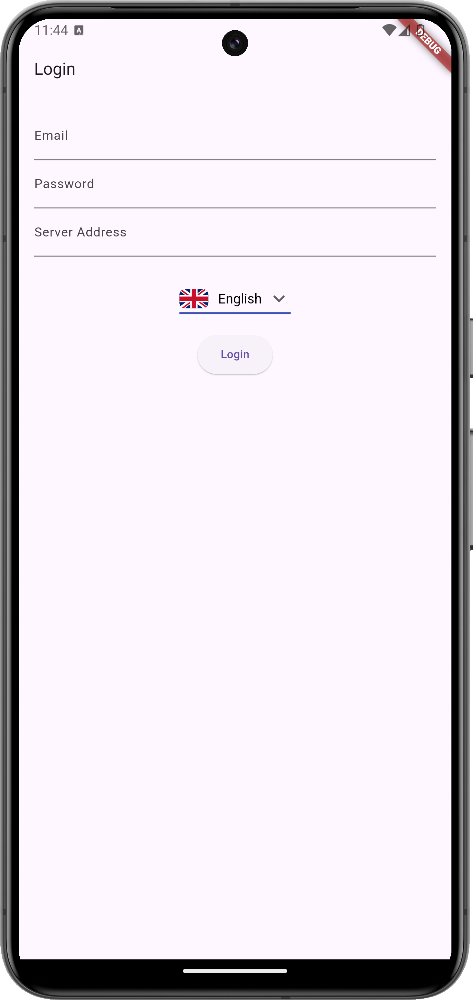
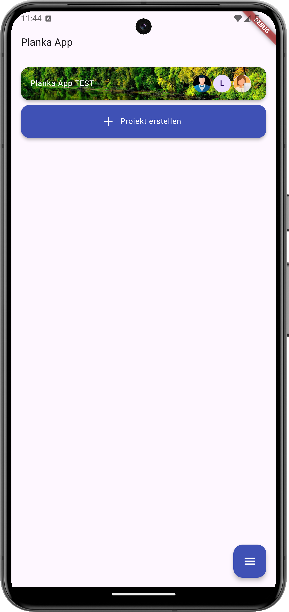
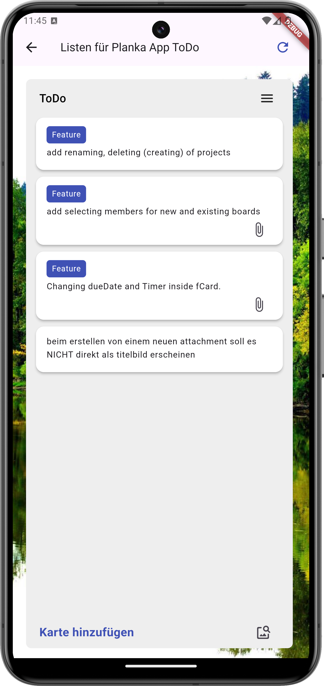
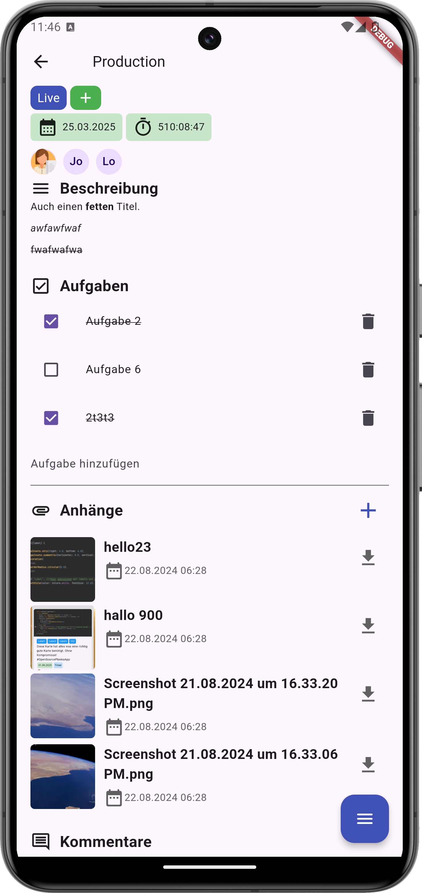
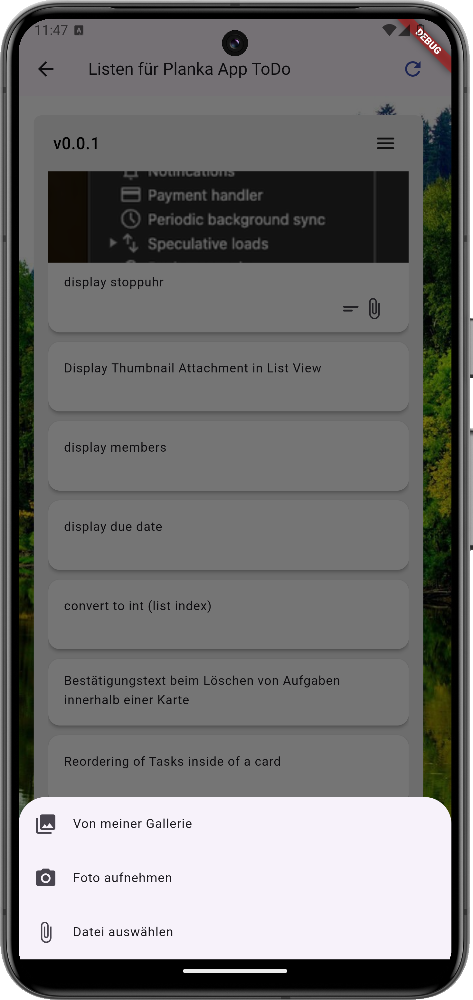
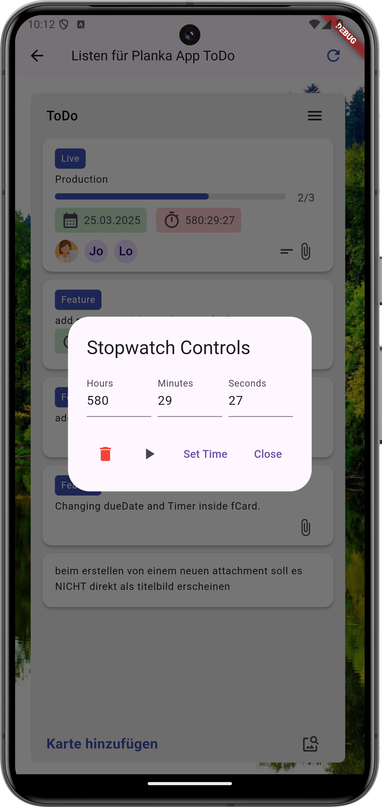

# Planka App

Planka App is an open-source mobile application developed using [Flutter](https://flutter.dev). It integrates with the [Planka](https://github.com/plankanban/planka) open-source project management platform via its API, allowing users to manage boards, lists, and tasks from their mobile devices.

## Features

- **Board Management**: Create and manage project boards.
- **Task Lists**: Organize tasks into lists for better workflow management.
- **Task Management**: Add, update, delete, and organize tasks (cards) across lists.
- **Attachments**: Upload and manage attachments for tasks.
- **User Authentication**: Authenticate users through Planka's built-in authentication.
- **Multi-language Support**: Support for multiple languages (coming soon).

## Roadmap

- App Wide Caching
- Enhanced Multi Language Support
- Renaming, Deleting, Creating of Projects
- Deleting and Creating of Boards
- Got any suggestions?

## Installation

### Prerequisites
- [Flutter](https://flutter.dev) SDK installed on your machine.
- A running instance of the [Planka API](https://github.com/plankanban/planka).

### Steps to Install
1.Clone this repository:

```bash
   git clone https://github.com/LouisHDev/planka_app.git
   ```

2.Navigate to the project directory:

```bash
   cd planka_app
   ```
   
3.Install the dependencies:

```bash
   flutter pub get
   ```
   
4.Run the app on an emulator or a real device:

```bash
   flutter run
   ```

5.Tipp:

Don´t forget to add your local.properties for developing :)

## Contributing

We welcome contributions to improve the Planka App! Whether you want to fix bugs, add new features, or improve documentation, your help is appreciated.

### How to Contribute:

1. Fork the repository.
2. Create a new branch (`git checkout -b feature-branch`).
3. Commit your changes (`git commit -m 'Add new feature'`).
4. Push the branch to your fork (`git push origin feature-branch`).
5. Open a pull request.

Before contributing, please ensure that all changes:

- Follow the [Flutter code style guidelines](https://dart.dev/guides/language/effective-dart/style).
- Pass all tests (`flutter test`).

## Issues

If you find any bugs or want to suggest new features, feel free to [open an issue](https://github.com/LouisHDev/planka_app/issues).

## Release

All the APK´s of the versions can be found as attachments below each release. For IOS, please reach out to me.

## Info

In the current App state, you will have to often refresh or go back to the boards and then back into where ever you were again. This is due to no caching at the moment. Planning to add this in the next Version. So keep in mind. The changes you´ve made are already on the Server, just not showing instantly.

## Support

If you need any help or have questions regarding the project, you can reach out to the maintainer:

- [GitHub](https://github.com/LouisHDev)
- Requests over Mail are not guaranteed to be answered.

## License

This project is licensed under the The Commons Clause License. See the [LICENSE](https://commonsclause.com/) file for details.

# App Preview

      
      

